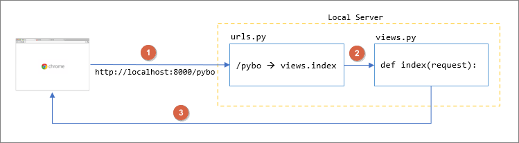

# Django 기본 환경 구성
## 1. 가상 환경 만들기
: 여기에 django 및 여러가지 패키지들을 다운받아 사용한다.
> 아무것도 없는 컴퓨터를 하나 만든다고 생각.
```
python -m venv [가상환경이름]
```

## 2. 가상 환경 실행하기(종료하기)
```
. myvenv/Scripts/activate
```
```
deactivate
```
## 3. django 다운로드 하기
```
pip install django
```
> ```pip install django === [버전]``` 쓰면 쓰고 싶은 버전을 다운받을 수 있다.

## 4. project 만들기
: 하나의 프로젝트만 있어도 된다.
```
django-admin startproject [프로젝트이름]
```

## 5. project안에 App 생성하기
: 프로젝트 구성단위인 App을 생성하자.
```
python manage.py startapp [앱이름]
```

## 6. Settings.py에 App 등록하기
: 앱을 생성한 후 프로젝트 내 setting.py 파일 안에 INSTALLED_APP안에 앱이름을 등록해주어야한다!
``` py
INSTALLED_APPS = [
    'django.contrib.admin',
    'django.contrib.auth',
    'django.contrib.contenttypes',
    'django.contrib.sessions',
    'django.contrib.messages',
    'django.contrib.staticfiles',
    'pybo', # 새로 만든 app
]
```

## 7. ```urls.py```에서 url을 설정해준다.
``` py
from django.contrib import admin
from django.urls import path
from pybo import views

urlpatterns = [
    path('admin/', admin.site.urls),
    path('pybo/', views.index), # 뒤에 / 붙여주기
]
```

## 8. ```views.py``` 내부에 함수(index) 만들어주기.
``` py
from django.shortcuts import render
from django.http import HttpResponse

def index(request):
    return HttpResponse("안녕하세요 pybo에 오신것을 환영합니다.")
```

## 9. 서버를 구동해서 화면에 띄워주기.
```
python manage.py runserver
```

## 10. 서버 종료
: ```ctrl^c```

## html 파일 넣기
### 1) app안에 template 관리 폴더 만들기
: ```templates```라는 이름을 가진 폴더여야한다.
### 2) templates 폴더 안에 html 넣기
### 3) ```view.py``` 내부에 html을 화면에 띄워주는 로직 쓰기.
``` py
from django.shortcuts import render

# Create your views here.
def home(request):
    return render(request, 'home.html')
```
# django의 흐름


# django .gitignore
```
*.pyc
*~
__pycache__
myvenv
db.sqlite3
/static
.DS_Store
```